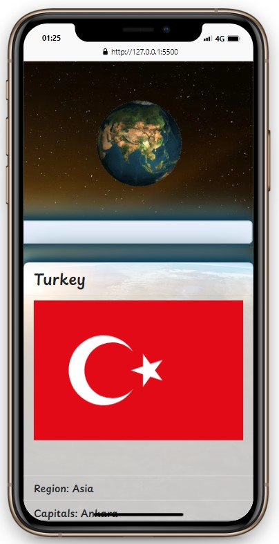
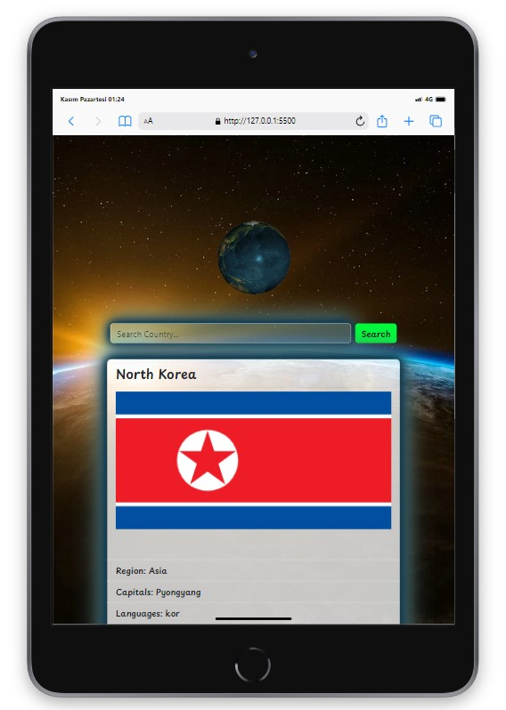
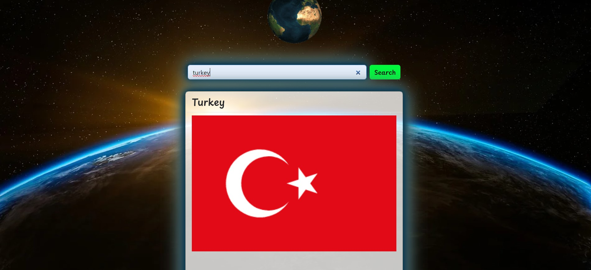
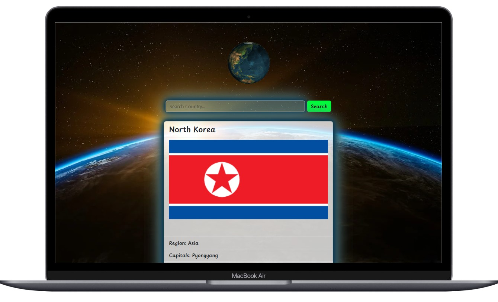

<!-- PROJECT LOGO -->
 

  

  <h3 align="center">Find The country</h3>

  

    Learn country information with this application
     
    <a href="https://find-country-chi.vercel.app/"><strong>Live »</strong></a>
     
  

<!-- TABLE OF CONTENTS -->

  
Table of Contents

  <ol>
    <li>
      <a href="#about-the-project">About The Project</a>
      <ul>
        <li><a href="#built-with">Built With</a></li>
      </ul>
    </li>
    <li><a href="#usage">Usage</a></li>
  </ol>

<!-- ABOUT THE PROJECT -->
## About The Project

 
 
With this project, you can learn the information of the country you want, including:
flag,  
Region,  
Capitals,  
languages,  
Borders,  
Currencies,  
population,  
It includes information such as.   

(<a href="#responsive">Go Responsive Designs</a>)

(<a href="#readme-top">back to top</a>)

### Built With

* [][Bootstrap-url]

## Usage
All you have to do is write the name of the country you are curious about in the input field and press the button.
## Notes
> [!NOTE]
> Great practice to DOM manipulating.  
> Big business in a short time. 🕓⌛  
> The code is complex and poorly readable because it was prepared with Turkish concepts and presented in English 
## Responsive Designs 📲💻
<!-- Responsive Designs -->

  <!-- First Row -->
  

    
    
  

  
  <!-- Second Row -->
  

    
    
  

(<a href="#readme-top">back to top</a>)

[Bootstrap-url]: https://getbootstrap.com